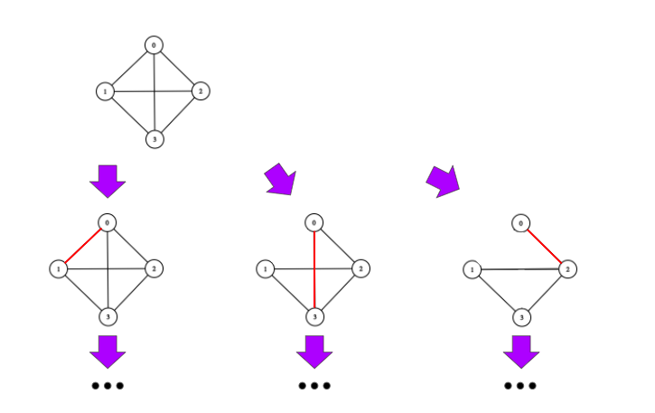

# EveryMST

&nbsp;&nbsp;&nbsp;&nbsp;&nbsp;&nbsp;This was a project for my Data Structures and Algorithms class. I wrote a program that generates every Minimum Spanning Tree (MST). Given a graph with weighted edges, _getMinimumSpanningTrees()_ will return a list of SpanningTrees of the graph where all members of the list are MSTs.

&nbsp;&nbsp;&nbsp;&nbsp;&nbsp;&nbsp;My approach is to build all possible spanning trees edge by edge, discarding the trees that exceed the total weight of the MST. If the spanning tree is completed and didn't exceed the total weight of an MST, then it is also an MST, and it is added to the list.

&nbsp;&nbsp;&nbsp;&nbsp;&nbsp;&nbsp;The challenge in this task is to make sure we produce every possible Spanning Tree but do not make copies of the same tree more than once. The logic I follow looks like this:

&nbsp;&nbsp;&nbsp;&nbsp;&nbsp;&nbsp;I start with the source vertex and go through incoming edges. I pick one edge and build every possible Spanning Tree recursively. Then I remove that edge and move onto the next one, going through all incoming edges and generating all spanning trees. I follow this logic at every recursive level, continuing until an MST is complete or the total weight of the Spanning Tree exceeds the minimum, in which case it is discarded.
